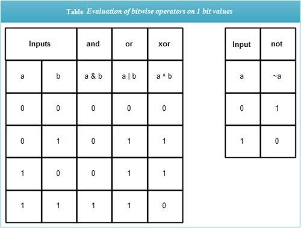

#  Bitwise Operators in C

Bitwise operators atau bit level progamming digunakan untuk memanipulasi suatu bentuk bit.

> <b>Note</b>: Bitwise operator hanya bisa dipalikasikan pada data type char dan integer saja.

<br>

# Bitwise Operators
1. The **& (Bitwise AND)**
   Operator ini akan mengevaluasi 1 jika kedua operands adalah 1. Selain hal tersebut maka 0
2. The **| (Bitwise OR)**
   Operator ini akan mengevalusi 1 jika salah satu dari kedua operands terdapat 1. Selain hal tersebut maka hasilnya adalah 0
3. The **^ (Bitwise XOR)**
   Operator ini akan mengevaluasi 1 jika salah satu dari operands adalah 1, tetapi keduanya bukanlah 1. Selain hal tersebut maka hasilnya adalah 0
4. The <b>~ (Bitwise NOT)</b>
   Operator ini akan mengevaluasi operands menjadi komplemennya, misal, return 1 jika operand adalah 0 (dan sebaliknya).
   <br><br>
   Keempat operator tersebut dirangkum dalam tabel berikut

   

   [Source Table](https://ecomputernotes.com/what-is-c/operator/c-bitwise-operators)

5. The **<< (Left Shift)**
    <br>
   Saat sebuah value shifted left, posisi kosong pada paling kanan (empty bit) akan diisi dengan bit 0 dan bit yang awalnya paling kiri akan hilang karena tergeserkan dengan bit yang ada di sebelah kanannya, misal, binnary 1011 dengan operator << akan menjadi 0110
6. The **>> (Right Shift)**
    <br>
   Operasi right shift serupa dengan operasi left shift, tetapi terdapat perbedaan, diantarannya
   - Right shift akan menggeser bit ke kanan
   - Hasil dari operator right shift *bergantung kepada apakah sebuah number adalah signed atau unsigned*

        <details><summary><b>Pengaruh signed atau unsigned pada hasil operasi shift right</b></summary>

        Pada unsigned number, operasi shift right akan mengisi bit paling kiri (empty bit) dengan bit 0. Shift ini dipanggi **The Logical Right Shift.**

        Pada signed number, operasi shift berjalan seperti biasanya, tetapi bit yang menjadi signed akan ter-copy dan akan mengisi empty bit. Operasi ini dipanggil **Arithmetic Right Shift**. Contoh,
        ```
        a adalah 1011
        b adalah 0111

        maka

        a >> 2 akan menjadi 1110
        b >> 2 akan menjadi 0001
        ```

        

        [Source Table](https://ecomputernotes.com/what-is-c/operator/c-bitwise-operators)
        </details>

## Contoh Pengaplikasian
```C
#include <stdio.h>

int main()
{
	unsigned char a = 8, b = 3;
	printf("Bitwise Operator | (OR)\n");
	printf("%d | %d = %d\n", a, b, a|b);

	printf("Bitwise Operator ^ (XOR)\n");
	printf("%d ^ %d = %d\n", a, b, a^b);

	printf("Bitwise Operator ~ (NOT)\n");
	printf("%d\n\n", a = ~a);

	// Problem: Gunakan property & operator untuk menentukan bilangan ganjil
	int x = 98;
	if (x&1) // Perhatikan bahwa angka ganjil pasti memiliki bit 1 pada ujung paling kanannya
	{
		printf("%d adalah bilangan ganjil\n\n", x);
	}
	else
	{
		printf("%d adalah bilangan genap\n\n", x);
	}

    // Problem: kalikan sebuah variable dengan angka dua, menggunakan bitwise operator
    int a1 = 20;
    printf("%d x 2 adalah %d\n\n", a1, a1 << 1);

	// Problem: Gunakan bitwise operator untuk melakukan integer division by 2
	int a2 = 11;
    printf("Integer division 11 dengan 2 adalah %d\n\n", a2 >> 1);

    return 0;
}
```

**OUTPUT**
```
Bitwise Operator | (OR)
8 | 3 = 11
Bitwise Operator ^ (XOR)
8 ^ 3 = 11
Bitwise Operator ~ (NOT)
247

98 adalah bilangan genap

20 x 2 adalah 40

Integer division 11 dengan 2 adalah 5
```
